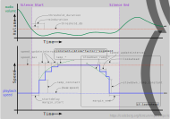

# mpv-skipsilence

Increase playback speed during silence - a revolution in attention-deficit
induction technology.

Main repository: https://codeberg.org/ferreum/mpv-skipsilence/

Based on the script https://gist.github.com/bitingsock/e8a56446ad9c1ed92d872aeb38edf124

This is similar to the NewPipe app's built-in "Fast-forward during silence"
feature.

> Note: In mpv version 0.36 and below, the `scaletempo2` filter (default since
> mpv version 0.34) caused audio-video de-synchronization when changing speed
> a lot. This has been fixed in mpv 0.37. See [mpv issue
> #12028](https://github.com/mpv-player/mpv/issues/12028). Small, frequent
> speed changes instead of large steps may help to reduce this problem. The
> scaletempo and rubberband filters didn't have this problem, but have
> different audio quality characteristics.

## Features:

- Parameterized speedup ramp, allowing profiles for different kinds of
  media (`ramp_*`, `speed_*`, `startdelay` options).
- Noise reduction of the detected signal. This allows to speed up
  pauses in speech despite background noise. The output audio is
  unaffected by default (`arnndn_*` options).
- Saved time estimation.
- Integration with osd-msg, auto profiles, etc. (with user-data, mpv 0.36 and
  above only).
- Experimental: Lookahead for dynamic slowdown and faster reaction time
  (`lookahead`, `slowdown_ramp_*`, `margin_*` options).
- Workaround for scaletempo2 audio-video desynchronization in mpv 0.36 and
  below (`resync_threshold_droppedframes` option).
- Workaround for clicks during speed changes with scaletempo2 in mpv 0.36 and
  below (`alt_normal_speed` option).

### Silence detection visualized

The following graph shows an example silence detection and resulting playback
speed, annotated with options that impact speed changes.

If the experimental `lookahead` option is set to a positive value, the effect
of some options changes:

1) Without lookahead, `Silence Start` is delayed by
`threshold_duration`. If lookahead is active, it reduces this delay by up to
that configured lookahead duration.

2) `minduration` is only supported with lookahead.

3) `startdelay` is ignored if lookahead is enabled and
`margin_start` is used instead.

4) The box marked `if lookahead` only applies if lookahead is
active. Otherwise, the speed is reverted in a single step exactly at the time
of `Silence End` detection.

## Default bindings

- F2 - toggle
- F3 - threshold-down
- F4 - threshold-up

## Documentation

For detailed usage check the comments at the top of the [script](skipsilence.lua).

## Recommendations

### Temporarily disable display sync

When using `video-sync=display-*`, speed changes tend to cause increased video
lag. Because display sync is less useful while speed keeps changing, it's
recommended to use `video-sync=audio` (the default) while this script is
active. This results in smoother video playback during speed transitions.

The following profile can be used to automatically switch to `video-sync=audio`
when skipsilence is enabled and restore it when disabled (requires mpv 0.36 or
above for user-data):

    [auto-skipsilence-videosync]
    profile-cond=get("user-data/skipsilence/enabled")
    profile-restore=copy-equal
    video-sync=audio

### Fix clicking sounds/gaps when switching to and from 1x speed

In the default configuration, mpv automatically inserts scaletempo2 filter when
changing speed and removes it when returning to 1x playback speed. This often
causes clicks in audio playback. To prevent this, add `scaletempo2` to the `af`
filter list explicitly:

    af-add=scaletempo2

In mpv 0.36 and below, the scaletempo2 filter itself additionally caused
similar artifacts when switching to and from 1x speed. This has been fixed in
mpv 0.37. The `alt_normal_speed` option of this script is a workaround for
older versions.

### Fix silence at high playback speed

By default, scaletempo2 produces silence above 8x playback speed (4x in mpv
0.36 and below). To lift this limit, set the `max-speed` parameter in the
filter definition (see above) like this:

    af-add=scaletempo2=max-speed=16.0

### Maximize skipping speed

Because of the asynchronous nature of scripts, there is latency between silence
detection and speed changes. The higher the playback speed, the more noticeably
playback will overshoot before normal speed is restored. What speeds are
acceptable depends on the performance/latency of the system.

To maximize skipping speed, start with the extreme profile (see
[Profiles](#profiles) below). Then adjust `ramp_constant`, `ramp_factor`,
`max_speed` options as needed.

- If overshooting happens all the time, even for very short pauses, reduce
  `ramp_constant`.
- If it happens after the speed ramped up more, focus on `ramp_factor`.
- For the occasional long stretch of silence this may be less of a problem, but
  can be improved by reducing `max_speed` at a cost of slower skipping.
- Notice that extreme values of `ramp_exponent` tend to be less useful. It's
  recommended to keep the `ramp_exponent` around 0.9 for aggressive profiles.

#### Lookahead

The experimental lookahead option makes much higher maximum speed practical by
gradually slowing down before the end of silence is reached. See the
`lookahead`, `slowdown_ramp_*` and `margin_*` options. To maximize skipping
speed, use a slowdown ramp that is as steep as possible without overshooting on
slowdown. `margin_end` can help, but is usually not required.

### Profiles

Mpv's profiles can be used to switch between different presets. Create profiles
in `mpv.conf` and apply them with the `apply-profile` command.

    [skipsilence-default]
    script-opts-append=skipsilence-ramp_constant=1.25
    script-opts-append=skipsilence-ramp_factor=2.5
    script-opts-append=skipsilence-ramp_exponent=1
    script-opts-append=skipsilence-speed_max=4
    script-opts-append=skipsilence-speed_updateinterval=0.05
    script-opts-append=skipsilence-startdelay=0.05

Bind it to a key in `input.conf`:

    F5 script-message-to skipsilence enable no-osd; apply-profile skipsilence-default; show-text "skipsilence profile: default"

#### Examples

    # very smooth speed increase, up to 3x
    [skipsilence-smooth]
    script-opts-append=skipsilence-ramp_constant=1
    script-opts-append=skipsilence-ramp_factor=0.4
    script-opts-append=skipsilence-ramp_exponent=1.45
    script-opts-append=skipsilence-speed_max=3
    script-opts-append=skipsilence-speed_updateinterval=0.05
    script-opts-append=skipsilence-startdelay=0
    script-opts-append=skipsilence-threshold_duration=0.25

    # very aggressive skipping, can make it hard to listen
    [skipsilence-extreme]
    script-opts-append=skipsilence-ramp_constant=2.5
    script-opts-append=skipsilence-ramp_factor=10
    script-opts-append=skipsilence-ramp_exponent=0.9
    script-opts-append=skipsilence-speed_max=6
    script-opts-append=skipsilence-speed_updateinterval=0.05
    script-opts-append=skipsilence-startdelay=0
    script-opts-append=skipsilence-threshold_duration=0.05

    # long wait (1s) before speeding up quickly
    [skipsilence-patient]
    script-opts-append=skipsilence-ramp_constant=1.25
    script-opts-append=skipsilence-ramp_factor=3
    script-opts-append=skipsilence-ramp_exponent=0.9
    script-opts-append=skipsilence-speed_max=4
    script-opts-append=skipsilence-speed_updateinterval=0.05
    script-opts-append=skipsilence-startdelay=0
    script-opts-append=skipsilence-threshold_duration=1
